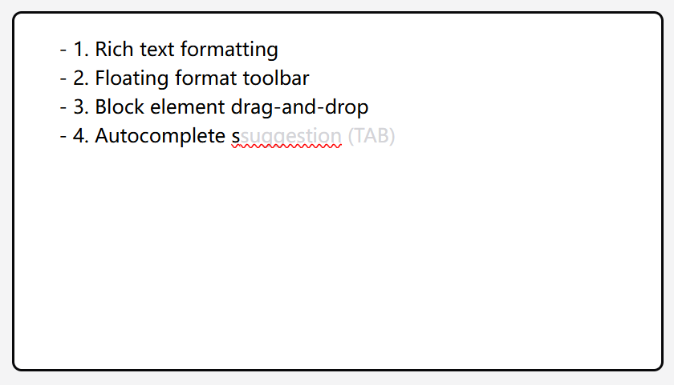
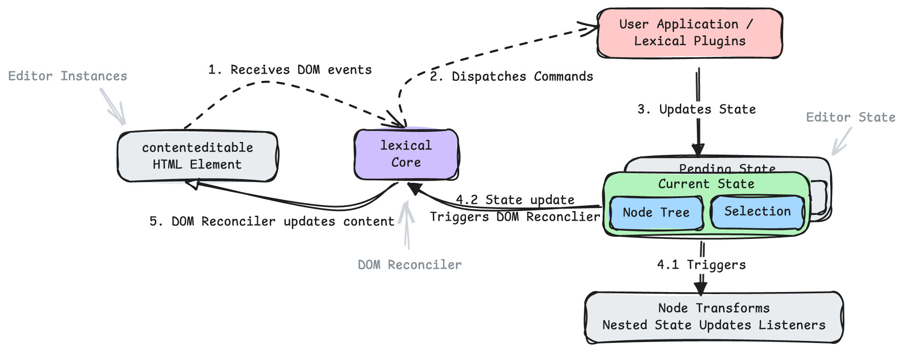

# mini-editor

the editor based on lexical.

## Project Overview: Lexical-based Rich Text Editor



### Features

- Rich text formatting
- Floating format toolbar
- Block element drag-and-drop
- Autocomplete suggestions

## Development

```bash
npm run start:dev
```


### Tech Stack

- Core Framework: React + Lexical
- Build Tool: Webpack
- Styling: Tailwind CSS
- Component Library: Floating UI + Lucide

### Lexical

How lexical works: 

